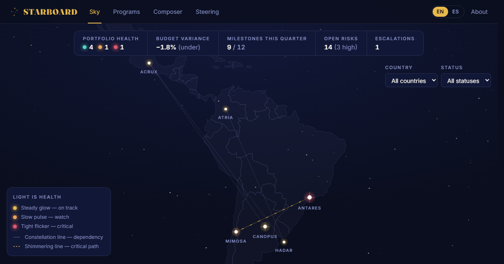

# STARBOARD — Enterprise Program Constellation · LATAM



**Every program is a star. This is the sky.**

STARBOARD is a consolidated portfolio view of six fictional enterprise technology programs
across Latin America, rendered as a living night sky. Each program is a star positioned over
its hub city; dependencies are constellation lines; health is light — a steady gold glow for
green, a slow amber pulse for watch, a tight ember flicker for critical. Underneath the sky
it is a working PMO command center: RAID logs, milestone timelines with a fixed demo date of
5 August 2026, budget burn and forecast-at-completion, an OCM adoption curve, a DMAIC
continuous-improvement case, audience-aware executive status composition in English and
Spanish, and a print-ready steering committee one-pager.

**Live:** https://aitoolscian-cpu.github.io/starboard/

Built by [Cian O'Donovan](https://www.linkedin.com/in/cianodonovan1/) as part of an
application for the **Program Manager, Enterprise Technology (LATAM)** role at
The Walt Disney Company (Buenos Aires).

## Why this demo

| The role's responsibility | Where it lives in the app |
| --- | --- |
| One consolidated view of the portfolio | **Sky** — every program is a star; health is light |
| Cross-project dependencies & risk | Constellation lines + per-program **RAID** logs |
| Executive status reporting | **Composer** — audience-aware briefs, EN/ES |
| Budget tracking & forecasting | **Financials** — burn, variance, forecast at completion |
| Change management & adoption | **CANOPUS → Adoption** — curve, training, champions |
| Steering-ready communication | **Steering** — print-optimized one-pager |

## Stack

Vite · React 18 · TypeScript (strict) · Tailwind CSS · Framer Motion · Recharts (lazy-loaded) ·
d3-geo with a locally bundled Latin America GeoJSON · canvas-confetti · self-hosted Fraunces &
Inter variable fonts. No backend, no API keys, no database — a static site that runs forever, free.

- Bilingual throughout: every UI string and every seed-data narrative ships in English and
  neutral Latin-American business Spanish.
- Accessibility: WCAG AA contrast, visible focus rings, keyboard-navigable sky,
  `prefers-reduced-motion` respected everywhere (static starfield, no fireworks).
- Initial JS ≈ 125 KB gzip; charts load on demand.

## Run it

```bash
npm i
npm run dev        # local dev
npm run build      # production build → dist/
npm run preview    # serve the build on :4173
```

Deployed to GitHub Pages from the `gh-pages` branch (`npx gh-pages -d dist`); the Vite `base`
is `/starboard/`.

## Honesty notes

- **All data is fictional** — programs, people, vendors, and figures are invented for the demo.
- The Status Composer **simulates** AI generation with pre-authored content for reliability;
  nothing calls a live model.

*An independent, unofficial demo. Not affiliated with, endorsed by, or created by
The Walt Disney Company. No Disney intellectual property is used.*
